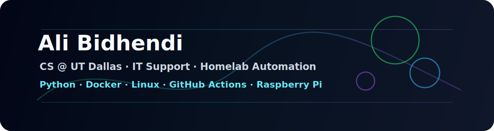

 

---

## About me

I’m a Computer Science student at UT Dallas building practical IT, automation, and homelab projects.  
My focus is turning support-work problems into clean tools: health checks, log analysis, repo maintenance, monitoring, and automation workflows.

---

## Featured projects

<table>
  <tr>
    <th>Project</th>
    <th>What it does</th>
    <th>Focus</th>
  </tr>
  <tr>
    <td><a href="https://github.com/LazyPanda902/ad-health-checker"><b>ad-health-checker</b></a></td>
    <td>Active Directory DNS, Kerberos, LDAP, and service-port health checks.</td>
    <td>Python · IT Support · CLI</td>
  </tr>
  <tr>
    <td><a href="https://github.com/LazyPanda902/supportops-toolkit"><b>supportops-toolkit</b></a></td>
    <td>IT account auditing and SSH authentication log analysis.</td>
    <td>Python · Security Ops · Logs</td>
  </tr>
  <tr>
    <td><a href="https://github.com/LazyPanda902/homelab-healthwatch"><b>homelab-healthwatch</b></a></td>
    <td>Raspberry Pi homelab container and service health checks.</td>
    <td>Python · Docker · Linux</td>
  </tr>
</table>

---

## Tech stack

---

## What I’m building now

<table>
  <tr>
    <td><b>GitHub portfolio automation</b></td>
    <td>Daily commits, weekly issue creation, PR branches, CI checks, and repo polish reports.</td>
  </tr>
  <tr>
    <td><b>Raspberry Pi control center</b></td>
    <td>A private dashboard for containers, logs, automations, backups, and system health.</td>
  </tr>
  <tr>
    <td><b>Support tooling</b></td>
    <td>Small Python utilities for IT support, account checks, service health, and troubleshooting.</td>
  </tr>
</table>

---

## Homelab focus

- Docker services and self-hosted monitoring
- Raspberry Pi automation jobs
- GitHub profile and repo maintenance
- Local LLM experiments for simple automation tasks
- Backup, health-check, and status-report workflows

---

## GitHub stats

---

## Contact

- GitHub: [@LazyPanda902](https://github.com/LazyPanda902)
- LinkedIn: [Ali Bidhendi](https://www.linkedin.com/in/alibidhendi)

